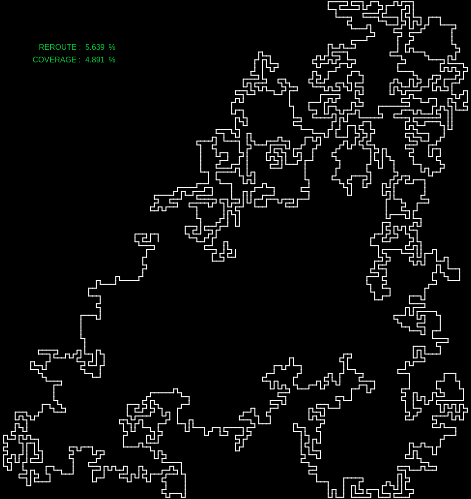

# Self-Rerouting Path

This is a semi-autonomous space filling curve. It starts from the center of the canvas and places segments randomly until the only choices for it would result in it hitting a wall or self-intersecting. At this point, the curve can remove its own segments which allows it to revert back to a previous state and make a diffetent choice. How far back it can revert depends on how many times it has had to re-route and how many segments are in the path. If it has frequently found itself without any valid candidates, then it is likely in an enclosure and would need to revert back significantly to escape the enclosure. Similarly, it the path is very long, then the likelyhood of ending up in an enclosure is far higher and in both these cases, we grant it the ability to revert back many segments. 

